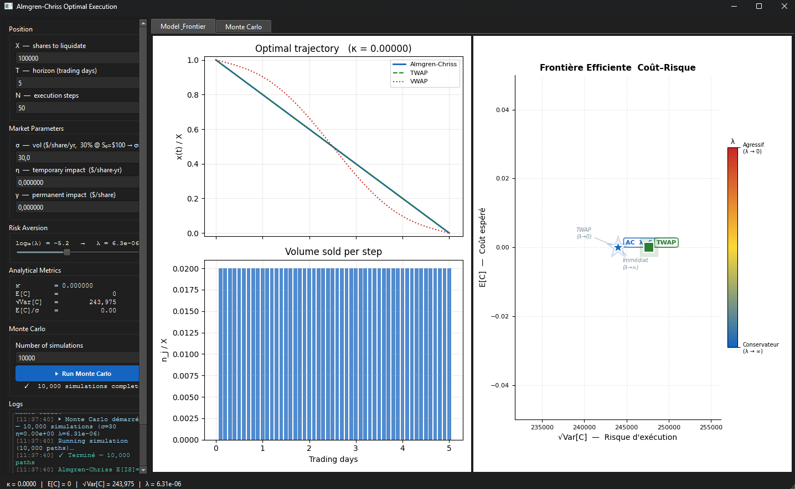
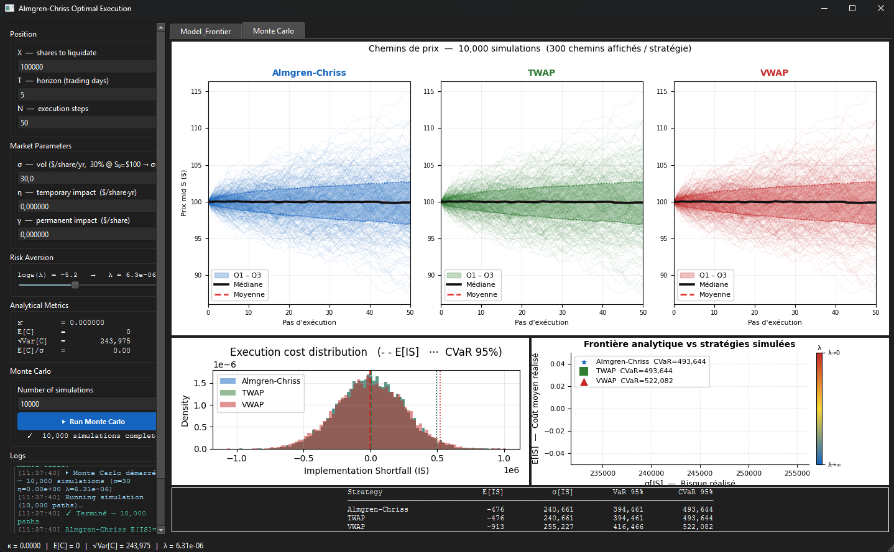

# Almgren-Chriss Optimal Execution

> **Problem:** you need to liquidate a large position over a finite horizon. Trading too fast destroys price via market impact; trading too slowly accumulates price risk. The Almgren-Chriss (2001) model solves this tension analytically.

This repository is a full Python implementation of the model — closed-form optimal trajectory, efficient frontier, Monte Carlo IS simulation, real-data parameter calibration, and an interactive PyQt6 dashboard.


---

## What this project does

### The core problem

When liquidating X shares over T days with N execution steps, every trade moves the price against you in two ways:

- **Permanent impact** (γ): each share traded shifts the mid price permanently — a fixed cost γX²/2 regardless of the schedule.
- **Temporary impact** (η): large trades in a single step push the execution price away from mid — a cost proportional to the square of the trading rate.
- **Price risk** (σ): the longer you hold the position, the more the mid price drifts against you.

The Almgren-Chriss objective function balances these:

$$U = E[C] + \lambda \cdot \text{Var}[C]$$

where λ is the trader's risk aversion. Minimising U yields a **closed-form optimal trajectory**:

$$x^*(t) = X \cdot \frac{\sinh\!\bigl(\kappa(T-t)\bigr)}{\sinh(\kappa T)}, \qquad \kappa = \sqrt{\frac{\lambda\,\sigma^2}{\eta}}$$

- λ → 0: κ → 0 → uniform liquidation (TWAP) — maximise time-in-market, accept full price risk
- λ → ∞: κ → ∞ → immediate liquidation — eliminate price risk, pay maximum impact

Sweeping λ ∈ [0, +∞) traces an **efficient frontier** in (√Var[C], E[C]) space — the execution analogue of the Markowitz frontier.

### What's implemented

| Component | Description |
|-----------|-------------|
| **Closed-form model** | Optimal trajectory, trading rate, E[C] and Var[C] — exact formulas with overflow guards for extreme κT |
| **Efficient frontier** | Full cost–risk frontier sweeping λ |
| **Benchmark strategies** | TWAP (uniform) and VWAP (volume-weighted) for comparison |
| **Monte Carlo simulator** | Vectorised IS distribution, VaR 95%, CVaR 95% across AC / TWAP / VWAP |
| **Real-data calibration** | σ from realised vol, γ from OLS regression on price impact, η from non-linear fit — all from OHLCV via yfinance |
| **Extensions** | Step-wise volatility regimes (`VolatilityRegimeModel`), intraday participation constraint (`IntradayConstrainedModel`) |
| **Interactive dashboard** | PyQt6 GUI — live trajectory + frontier update on slider change, threaded Monte Carlo with path plots |

---

## Screenshots

**Model & Frontier tab** — optimal trajectory vs TWAP/VWAP, volume schedule, and efficient frontier with gradient λ colormap:



**Monte Carlo tab** — 10 000 simulated price paths per strategy, IS distribution with CVaR 95%, and simulated vs analytical frontier:



---

## Installation

**Prerequisites:** Python 3.11+, PyQt6-compatible display for the dashboard.

```bash
git clone https://github.com/yanisblanco/almgren-chriss-optimal-execution.git
cd almgren-chriss-optimal-execution

python -m venv env

# Windows
env\Scripts\activate
# Linux / macOS
source env/bin/activate

pip install -r requirements.txt
```

---

## Usage

### Interactive dashboard

```bash
python app/dashboard.py
```

Adjust σ, η, γ, λ with sliders — trajectory and frontier update live.
Click **▶ Run Monte Carlo** to compare IS distributions across AC / TWAP / VWAP with path plots.

### Jupyter notebooks

```bash
jupyter notebook notebooks/
```

Three progressive notebooks, each self-contained:

| Notebook | Content | Viewer |
|----------|---------|--------|
| `01_model_intuition.ipynb` | Optimal trajectories vs λ, efficient frontier, parametric sensitivity (σ, η, γ), discrete vs continuous convergence | [nbviewer](https://nbviewer.org/github/Wilfrid-art/almgren-chriss-optimal-execution/blob/main/notebooks/01_model_intuition.ipynb) |
| `02_real_data_calibration.ipynb` | Calibrate σ, η, γ on AAPL via yfinance + Corwin-Schultz spread estimator, then compute the optimal trajectory on real parameters | [nbviewer](https://nbviewer.org/github/Wilfrid-art/almgren-chriss-optimal-execution/blob/main/notebooks/02_real_data_calibration.ipynb) |
| `03_strategy_comparison.ipynb` | Monte Carlo: AC vs TWAP vs VWAP, IS distributions, CVaR analysis, λ sensitivity scan | [nbviewer](https://nbviewer.org/github/Wilfrid-art/almgren-chriss-optimal-execution/blob/main/notebooks/03_strategy_comparison.ipynb) |

> **Note:** GitHub's built-in notebook preview can intermittently fail on larger notebooks. Use the nbviewer links above for reliable rendering, or open locally with Jupyter.

### Tests

```bash
pytest tests/test_model.py -v
```

30+ tests covering TWAP/immediate limits, analytical vs Monte Carlo convergence, market impact functions, and input validation.

### Programmatic API

```python
from src.almgren_chriss import AlmgrenChrissModel
from src.simulator import ExecutionSimulator

model = AlmgrenChrissModel(
    X=100_000,       # shares to liquidate
    T=5.0 / 252,     # 5 trading days
    N=50,            # execution steps
    sigma=30.0,      # absolute vol: 30 $/share/√yr  (= 30% for a $100 stock)
    eta=1e-8,        # temporary impact  [$ · yr / share²]
    gamma=5e-9,      # permanent impact  [$ / share]
    lam=1e-7,        # risk aversion  (0 → TWAP,  +∞ → immediate)
)

holdings = model.optimal_trajectory()         # shape (N+1,)
risks, costs = model.efficient_frontier(n_points=200)

sim = ExecutionSimulator(model, S0=100.0)
results = sim.run_all_strategies(n_sims=10_000, seed=42)
for r in results.values():
    print(r.summary())
```

Expected output (seed=42, 10 000 simulations):

```
Almgren-Chriss       | E[IS]=       5,428 | σ[IS]=     198,510 | VaR95=     329,592 | CVaR95=     412,679
TWAP                 | E[IS]=       4,589 | σ[IS]=     240,661 | VaR95=     399,526 | CVaR95=     498,709
VWAP                 | E[IS]=       5,324 | σ[IS]=     255,227 | VaR95=     422,703 | CVaR95=     528,319
```

> **Parameter units** — σ is in **$/share/√yr** (absolute). For a stock at price S₀: `sigma = annualised_vol_fraction × S₀`. η is in **$ yr / share²**; γ is in **$/share**. All cost quantities (E[IS], σ[IS], VaR, CVaR) are in **dollars**.

---

## Architecture

```
almgren-chriss-optimal-execution/
├── src/
│   ├── almgren_chriss.py   # Core model: closed-form solution, efficient frontier, TWAP/VWAP
│   ├── simulator.py        # Vectorised Monte Carlo — IS, VaR, CVaR
│   ├── market_impact.py    # Linear & power-law impact functions, MarketImpactCalibrator
│   ├── extensions.py       # VolatilityRegimeModel (step-wise σ), IntradayConstrainedModel (pmax)
│   └── data_fetcher.py     # yfinance OHLCV wrapper + Corwin-Schultz spread estimator
├── app/
│   └── dashboard.py        # Interactive PyQt6 dashboard (live plots, threaded MC)
├── notebooks/
│   ├── 01_model_intuition.ipynb
│   ├── 02_real_data_calibration.ipynb
│   └── 03_strategy_comparison.ipynb
└── tests/
    └── test_model.py       # 30+ unit tests
```

---

## Model — analytical details

**Analytical expected cost and variance:**

$$E[C] = \frac{\gamma}{2}X^2 + \eta X^2 \kappa \cdot \frac{\sinh(\kappa T)\cosh(\kappa T) + \kappa T}{2\sinh^2(\kappa T)}$$

$$\operatorname{Var}[C] = \sigma^2 X^2 \cdot \frac{\sinh(\kappa T)\cosh(\kappa T) - \kappa T}{2\kappa\,\sinh^2(\kappa T)}$$

**Parameter summary:**

| Symbol | Role | Limiting behaviour |
|--------|------|--------------------|
| X | Shares to liquidate | — |
| T | Execution horizon | — |
| σ | Asset volatility | σ → 0: no price risk, strategy collapses to TWAP |
| η | Temporary impact coefficient | η → 0: zero impact cost |
| γ | Permanent impact coefficient | fixed cost γX²/2, path-independent |
| λ | Risk aversion | λ → 0: TWAP &nbsp;·&nbsp; λ → ∞: immediate liquidation |
| κ | Decay rate κ = √(λσ²/η) | controls how front-loaded the schedule is |

**Key insight:** γ (permanent impact) does not change the shape of the optimal trajectory — it contributes only a fixed cost independent of the execution path. The shape is entirely controlled by κ = √(λσ²/η).

---

## Reference

Almgren, R. & Chriss, N. (2001). *Optimal Execution of Portfolio Transactions*. **Journal of Risk**, 3, 5–40.
